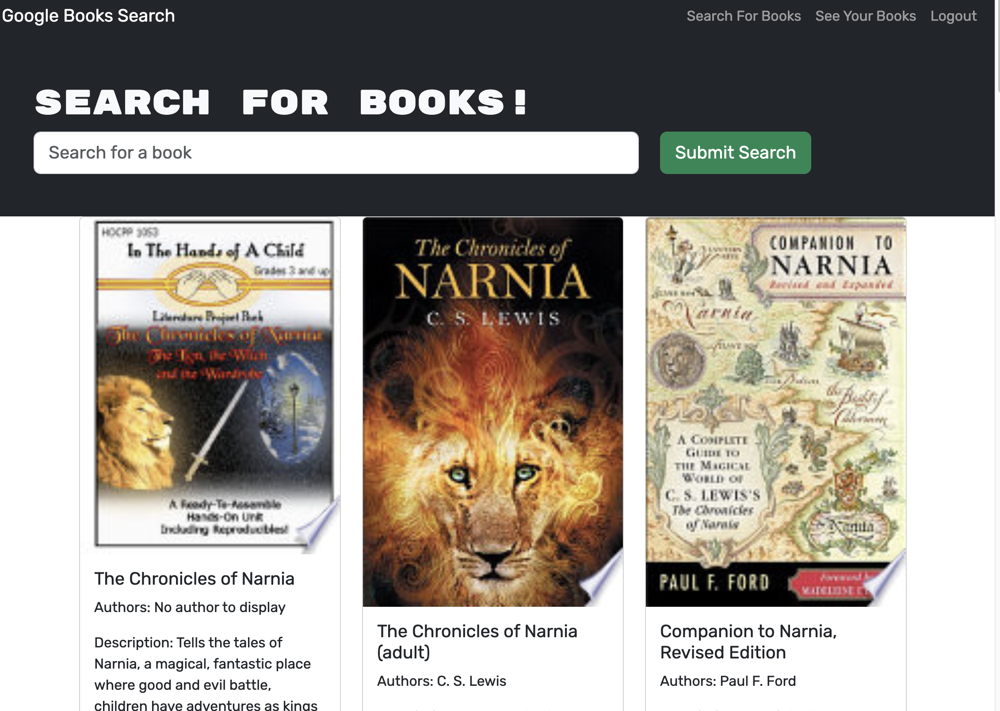

# Google Books Search Engine

## Description
Search for books using the Google Books API. Save your favorites to your list and get more information about your choices.

## Table of Contents
- [Installation](#installation)
- [Usage](#usage)
- [License](#license)
- [Questions](#questions)

## Installation
Developers can access the application by running 'root/>npm run develop'. This command will start both the backend and the frontend servers, which listen on ports :4000 and :3000 respectively.

## Usage
This is a deployed web application.  
To try out the Search engine, visit the website  [Book Search](https://book-search-eqes.onrender.com "Book Search")  
You can also see the code repository on   [GitHub](https://github.com/stever001/books "My Repo")

Here is a screenshot of the application:  

## License

This project is licensed under the MIT license.

## Questions
For questions, contact steve17rouse@gmail.com. Visit [GitHub](https://github.com/stever001).
